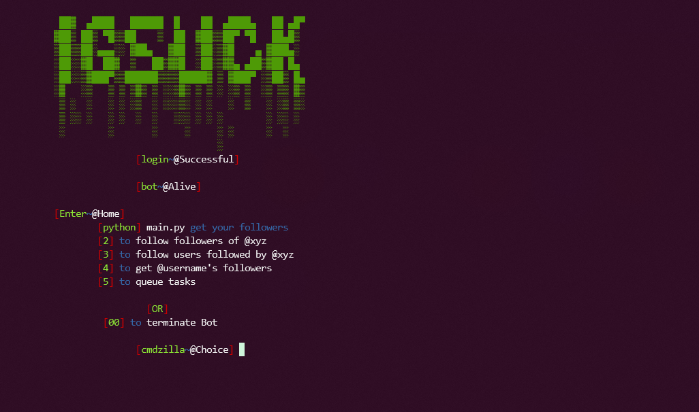
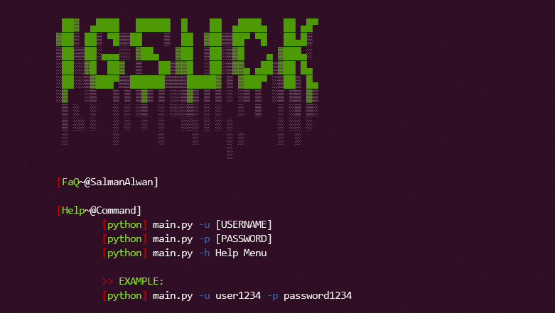

<h1 align="center">
  </a>
  <br>
</h1>

<h4 align="center">Simple Instagram Designed Tool.</h4>

<p align="center">
  <a href="#features">Features</a> •
  <a href="#installation">Install</a> •
  <a href="#running-igSuck">Usage</a> •
</p>

---


igSuck is tool that developed by Salman Alwan aka JustFaQ to automate Instagram lifetime tasks. You may face some problems, feel free to edit the code. More tools will be added soon, Leave some ideas on my discord, faq#6067.

# Features

<h1 align="left">
  </a>
  <br>
</h1>

 - powerful tool
 - super cool ui

 # Usage

```sh
python main.py -h
```
This will display help for the tool.

<h1 align="left">
  </a>
  <br>
</h1>


# Installation

igSuck requires:
- python
- colorama
- selenium
- chrome

To install run these comands:
```sh
▶ sudo apt install git
```
```sh
▶ git clone https://github.com/JustFaQ/igSuck
```
```sh
▶ cd igSuck
▶ pip install -r requirements.txt
```

# Running igSuck

To run the tool on a target, just use the following command.
```sh
▶ python main.py -u test1234 -p password1234
```

